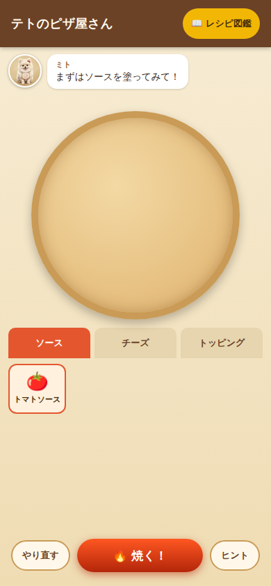
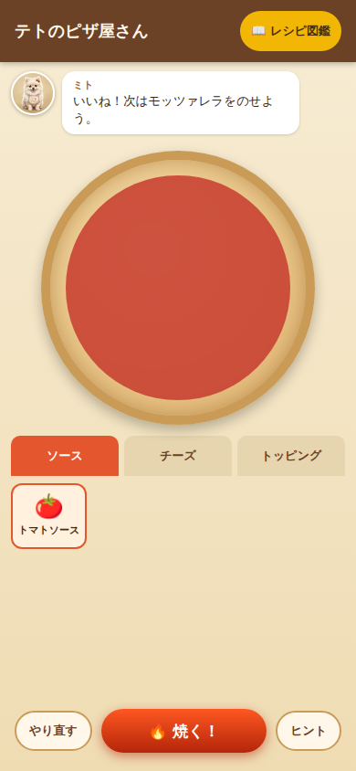
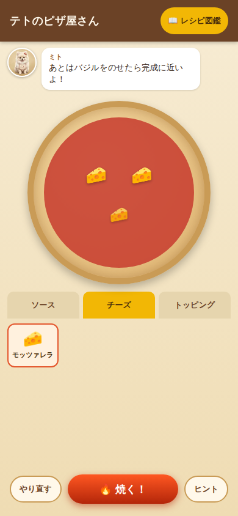
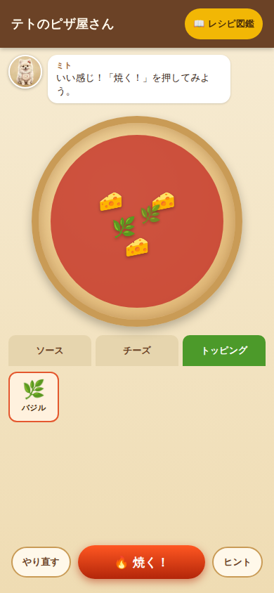
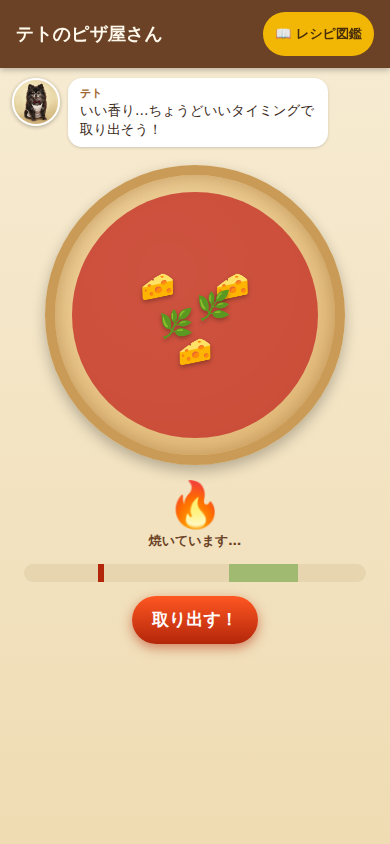
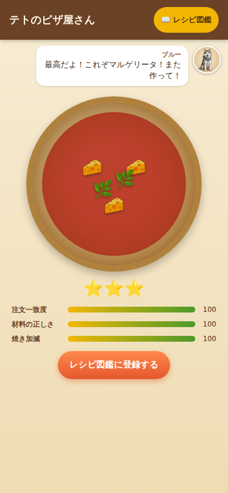
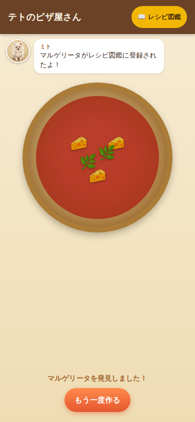
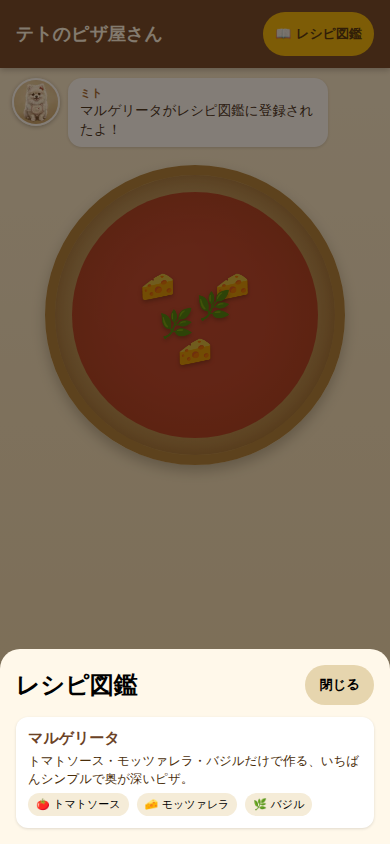
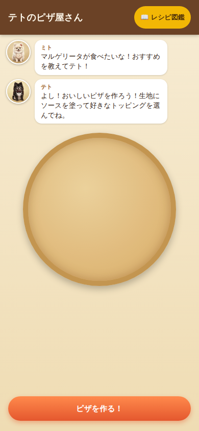

# PIZZA GAME Phase 1 実装結果報告

Status: Phase 1 完了
関連ドキュメント: `docs/design/PIZZA_GAME_SSOT.md` / `PIZZA_GAME_MVP_SPEC.md` /
`PIZZA_GAME_DATA_MODEL.md` / `PIZZA_GAME_UI_SPEC.md`

## 1. 実装内容

Phase 0 で作成した設計ドキュメントに基づき、マルゲリータ1種類の Vertical Slice を実装した。

- **プロジェクト構成**: Vite + React + TypeScript でスマホ向けSPAを新規構築（バックエンドなし）
- **ゲーム状態機械**: `ORDER → PREPARE → BAKE → RESULT → DISCOVERED` を `useReducer` ベースの
  リデューサーで実装（`src/state/gameReducer.ts`）
- **データ駆動設計**: 食材（`src/data/ingredients.ts`）・レシピ（`src/data/recipes.ts`）・
  注文（`src/data/orders.ts`）・キャラクターセリフ（`src/data/dialogue.ts`）をUIから分離。
  レシピや食材を増やす場合はデータ配列に1件追加するだけで動作する設計
- **ピザ作成操作**: ソース選択中にピザをタップすると全体に塗布（spread）、チーズ/トッピング選択中は
  タップした座標にアイコンを配置（scatter）。複数個配置可能で、「自分で作った」実感を重視した
- **焼成ミニゲーム**: 石窯演出＋左右に往復するゲージ。狙ったタイミングで「取り出す！」を押すと
  そのゲージ値を焼き加減として記録する
- **採点ロジック**: `src/logic/scoring.ts` に純粋関数として実装。注文一致度／材料の正しさ／焼き加減の
  3観点をそれぞれ0-100で算出し、平均から★1〜3を決定
- **キャラクター**: ユーザー提供の3枚の画像（テト・ミト・ブルー）をそのまま `src/assets/characters/`
  に配置し、吹き出しの肖像として使用。AIによる再生成は行っていない
- **レシピ図鑑**: 発見済みレシピをカード表示するオーバーレイ。未発見レシピは「？？？」表示にすることで
  将来のレシピ追加を見越した設計にした

## 2. 変更ファイル一覧（新規作成）

```
docs/design/PIZZA_GAME_SSOT.md
docs/design/PIZZA_GAME_MVP_SPEC.md
docs/design/PIZZA_GAME_DATA_MODEL.md
docs/design/PIZZA_GAME_UI_SPEC.md
docs/reports/PIZZA_GAME_Phase1_Result.md（本ドキュメント）
docs/reports/screenshots/*.png（動作確認スクリーンショット）
index.html
package.json / package-lock.json
vite.config.ts / tsconfig*.json / .oxlintrc.json / .gitignore
README.md
src/main.tsx / src/index.css
src/App.tsx / src/App.css
src/assets/characters/teto.webp
src/assets/characters/mito.webp
src/assets/characters/blue.webp
src/data/ingredients.ts
src/data/recipes.ts
src/data/orders.ts
src/data/dialogue.ts
src/state/pizzaState.ts
src/state/gameReducer.ts
src/logic/scoring.ts
src/components/DialogueBox.tsx
src/components/PizzaStage.tsx
src/components/IngredientTray.tsx
src/components/BakeOverlay.tsx
src/components/ResultPanel.tsx
src/components/DexOverlay.tsx
public/favicon.svg
```

（プロジェクトは空のリポジトリから `npm create vite` で新規作成したため、上記はすべて新規ファイルである）

## 3. 動作確認

- `npm run build`（`tsc -b && vite build`）が成功することを確認
- `npm run lint`（oxlint）でエラーなしを確認
- ローカルで `npm run dev` を起動し、Chromium（Playwrightスクリプトによる自動操作、
  ビューポート 390×844）で以下のゴールデンパスを手動シナリオとして通しで確認した:
  1. ゲーム開始時にミトがマルゲリータを注文し、テトが応答する
  2. 「ピザを作る！」でPREPAREへ遷移
  3. トマトソースを選択してピザをタップ → ソースが全体に塗られる
  4. チーズタブでモッツァレラを選択し、ピザ上の3箇所をタップ → 3個配置される
  5. トッピングタブでバジルを選択し、2箇所をタップ → 2個配置される
  6. 「焼く！」を押すとBAKE演出（炎アニメーション＋ゲージ）が始まる
  7. 目標レンジ内で「取り出す！」を押すとRESULTへ遷移
  8. ブルーの試食コメントと採点（注文一致度／材料の正しさ／焼き加減、いずれも100点・★3）が表示される
  9. 「レシピ図鑑に登録する」でDISCOVERED演出→図鑑にマルゲリータが登録される
  10. 図鑑オーバーレイでマルゲリータのカードが「発見済み」表示になることを確認
  11. 「もう一度作る」でORDERに戻り、再度ミトの注文が表示されることを確認
- 材料不足・焼き加減が悪いケース（ソースのみ塗って即座に焼成）でも採点ロジックが正しく機能し、
  ★1・各スコアが妥当に下がることを確認（例: 注文一致度33点・材料の正しさ100点・焼き加減21点）
- 表示崩れ確認: 360px / 390px / 428px / 1280px の各ビューポートで横スクロールが発生しないことを確認
- ブラウザコンソールにエラー・警告が出ないことを確認（React "key" spread警告を検出し修正済み）

## 4. スクリーンショット

| # | 画面 | 説明 |
|---|---|---|
| 1 |  | ORDER: ミトの注文とテトの掛け声 |
| 2 |  | PREPARE開始直後（未着手） |
| 3 |  | トマトソースを塗布 |
| 4 |  | モッツァレラを3箇所配置 |
| 5 |  | バジルを配置し「焼く」準備完了 |
| 6 |  | BAKE: 焼成ゲージと石窯演出 |
| 7 |  | RESULT: ブルーの試食と★3評価 |
| 8 |  | DISCOVERED: 図鑑登録演出 |
| 9 |  | レシピ図鑑（マルゲリータ発見済み） |
| 10 |  | 「もう一度作る」で再びORDERへ |

## 5. 未実装（Phase 1 スコープ外として意図的に見送ったもの）

- 複数レシピ・複数食材のバリエーション（データ構造は拡張可能な形で用意済み）
- 食材の購入・所持金・DAY進行などの経営要素（ヘッダーは静的プレースホルダーのみ）
- 配置済みトッピングの削除・ドラッグ移動などのリッチな操作（現状は再タップでの削除は未対応）
- ソースの部分塗り（現状は全体塗りのみ）
- localStorage等によるレシピ図鑑の永続化（現在はページリロードで図鑑がリセットされる、ランタイム状態のみ）
- 音声・SEなどのサウンド演出
- 自動テスト（unit/E2E）の常設化。今回は手動確認用の一時的なPlaywrightスクリプトで動作検証を行ったのみで、
  リポジトリには含めていない（過剰なE2Eを避ける方針のため）

## 6. 既知の問題点

- ミトのヒントセリフが1行→2行に変わるタイミングでダイアログ欄の高さが変わり、ピザの位置が
  数px下にずれる（体感できるレベルの小さな変化だが、レイアウトシフトとして今後改善余地あり）
- BAKEのゲージ速度・目標レンジ幅は初期値の暫定調整であり、実機での触り心地は未検証（実際のタッチ操作
  での難易度調整はPhase 2以降で要検討）
- 図鑑の「新規発見バッジ」（ヘッダーの図鑑ボタン）は未実装。初回登録時の演出はDISCOVERED画面内の
  バナーのみで表現している

## 7. 次Phase推奨事項

`docs/design/PIZZA_GAME_SSOT.md` 10章のロードマップに沿い、以下を推奨する。

1. **レシピ2〜3種追加**（例: マリナーラ、クアトロフォルマッジ等）とミトの注文ローテーション
   — データ追加のみで動く設計になっているため着手コストは低い
2. **ヒントの充実**とレイアウトシフト解消（ダイアログ欄の高さ固定化）
3. **配置済みトッピングの削除／移動**など操作性の改善（再タップで削除、ドラッグで再配置）
4. **図鑑の永続化**（localStorage導入）の検討
5. 実機（スマートフォン実機ブラウザ）でのタッチ操作・BAKEゲージ難易度の検証と調整

## 8. Commit / PR

- Commit SHA: `36e2880d7c28ff7254e6d5e9367cdfa77f85063f`
- PR URL: https://github.com/perusonao/teto-pizza-game/pull/1
