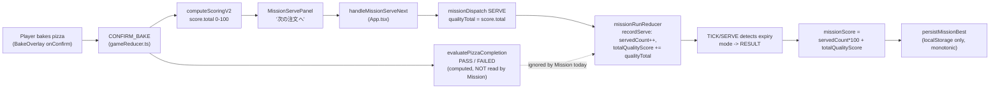
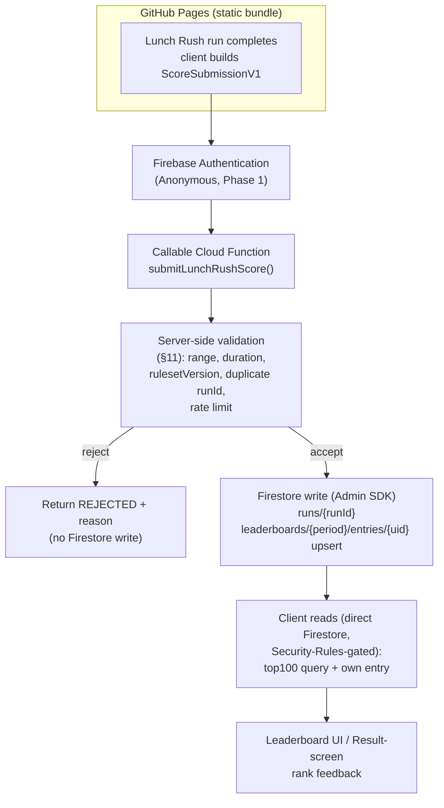

# Lunch Rush Online Ranking 1.0 — Phase 0 Fresh Architecture / Threat / Integration Audit

**Scope:** READ-ONLY architecture audit. No production code changed, no Firebase project created, no external service touched, no PR opened.
**Target:** Issue #87 — "Lunch Rush Online Ranking 1.0 — weekly / monthly / all-time (Firebase architecture)"
**Audited `origin/main` SHA:** `2ae37f1e022acb9fcf4bac644e38bd00fb1ff5f7` (2026-09-20, "Human Feel Tuning 1A: clarify insufficient sauce guidance (#103)")

---

## 0. Fresh GitHub / Duplicate Gate

- `git fetch origin` run against a clean working tree on `claude/lunch-rush-ranking-phase0-cpu5ki` (branched from the SHA above; no local diff from main).
- **Issue #87** (open, OWNER-authored, created 2026-09-19, last updated 2026-09-19) is the current SSOT for this feature. Its full body was read directly from GitHub (not from prior chat memory) — see Sections 1–19 below, which map 1:1 onto its requested scope.
- **Open PRs** at audit time: #72 (docs-only, PROJECT_HANDOFF status sync), #46 (Issue #33 Dough D0 audit), #34 (Issue #32 Phase 1 visuals), #3 (Pages infra docs). **None touch ranking, leaderboard, Firebase, or Lunch Rush scoring.**
- **Open branches**: `claude/lunch-rush-continuous-progression-58ko5o`, `claude/lunch-rush-mission-j9i57f`, `claude/pr91-lunch-rush-rebase-x7gke7` exist but none is a Phase 0 architecture/threat audit branch, and none is currently an open PR.
- **Issue search** for `firebase`/`ranking`/`leaderboard`/`lunch rush online` returned exactly one hit: Issue #87 itself.
- **Conclusion: no duplicate Phase 0 audit is in flight.** This is a fresh start on `claude/lunch-rush-ranking-phase0-cpu5ki`.

---

## 1. Current Lunch Rush Fresh Audit — Data Flow

Lunch Rush ("Mission") is a **thin outer wrapper** around the existing 5-phase FREE state machine (`ORDER → PREPARE → BAKE → RESULT → DISCOVERED`, `src/state/gameReducer.ts`), not a parallel implementation. Two reducers cooperate:

- `gameReducer.ts` — canonical per-pizza state (order/recipe/pizza/dex/inventory/score), shared by FREE and Mission.
- `src/mission/lunchRush.ts`'s `missionRunReducer` — Mission-only concerns: run clock, per-run metrics, `mode` (`FREE|INTRO|PLAYING|RESULT`), `runId`.

### 1.1 Start / order generation
- `App.tsx: startMission()` closes overlays, snapshots `missionBestAtStartOfRun` from local storage, dispatches `missionRunReducer` `START` (fresh `MissionClock`, `runId += 1`, metrics reset), then `gameReducer` `MISSION_RESET_ORDER`.
- `pickMissionOrder` (`src/mission/lunchRush.ts`) reuses FREE's exact `getNextOrder` pipeline (`src/data/orders.ts`) with no Mission-only weighting; only constraint is no immediate repeat.

### 1.2 Timer
- `MissionClock { startedAt, endsAt }` — **absolute epoch-ms timestamps from `Date.now()`**, not a decrementing counter (resistant to tab-throttling drift). Duration is `DEFAULT_MISSION_DURATION_SECONDS = 180`, hardcoded in production; a `?missionDuration=` override exists but is gated by `import.meta.env.DEV` and dead-code-eliminated from the production Vite build (`App.tsx` `resolveMissionConfig`). **All of this is 100% client-clock-driven today** — there is no server time anywhere in the current implementation (expected; nothing server-side exists yet).
- A 250ms interval (`MISSION_TICK_MS`) dispatches `TICK`; `isMissionExpired(now, clock)` is the single source of truth for "has this run ended," re-derived every read.

### 1.3 Recipe / bake / scoring (per pizza)
- `CONFIRM_BAKE` (`gameReducer.ts:685`) is the **one** call site, shared by FREE and Mission, that:
  1. computes `scoringV2Result` via `computeScoringV2(recipe, pizza)` (`src/logic/scoringV2/`), the sole scoring authority (legacy `scorePizza` retired),
  2. adapts it to a legacy `ScoreBreakdown` (`score.total`, 0–100, `score.stars`),
  3. **unconditionally** computes `completion = evaluatePizzaCompletion(recipe, pizza)` (Completion Gate Phase 1, `src/logic/completionGate.ts`) — PASS or FAILED (`MISSING_REQUIRED_INGREDIENT`/`INSUFFICIENT_REQUIRED_AMOUNT`/`INSUFFICIENT_SAUCE`/`UNDERBAKED`/`OVERBAKED`),
  4. consumes inventory regardless of completion outcome.
- **`score` and `scoringV2Result` are computed identically for FREE and Mission pizzas — completion is computed too, but only FREE's `REGISTER_TO_DEX` branches on it** (`if (state.completion?.status === "FAILED") return state;`).

### 1.4 Serve → Mission metrics (**the critical finding**)
- `App.tsx: handleMissionServeNext()` dispatches `missionDispatch({ type: "SERVE", qualityTotal: state.score.total, now })` **unconditionally** — it never reads `state.completion`.
- `MissionServePanel` (`src/components/MissionServePanel.tsx`), the component shown during Mission's RESULT phase, has **no `completion` prop at all** — a FAILED pizza (missing ingredient, insufficient sauce, under/overbaked) renders exactly like a normal result (stars + score + "次の注文へ") with no failure indication.
- `gameReducer.ts`'s `MISSION_NEXT_ORDER` case contains an explicit comment confirming this is a **known, deliberate deferral, not an oversight**:
  > "Completion Gate Phase 1 Scope Guard ... deliberately not read here — applying the gate to Lunch Rush's serve-a-quota flow is a Mission balance decision ... explicitly deferred to a later phase."
- `missionRunReducer`'s `SERVE` case then unconditionally calls `recordServe(metrics, qualityTotal)` (`src/logic/missionScoring.ts`): `servedCount += 1`, `totalQualityScore += qualityTotal`, `bestQualityScore = max(...)`.
- **Net effect: a FAILED pizza (e.g., zero required ingredients, drastically underbaked) still counts as a full serve at its raw `scoringV2` quality total inside Lunch Rush today.** This is exactly the open dependency Issue #87 itself flags in "Important dependencies" — confirmed live in code, not hypothetical. See §13.

### 1.5 Run end / MissionResult
- Ends on whichever of `TICK` or `SERVE` first observes `isMissionExpired` (one-shot `PLAYING → RESULT` transition; a race-safe design — a `SERVE` landing exactly at/after `endsAt` is rejected and also ends the run).
- `missionScore(metrics) = round(servedCount * 100 + totalQualityScore)` (`src/logic/missionScoring.ts`) — **this is the exact value that would become a leaderboard score.**
- `averageQualityScore`, `bestQualityScore` are derived, display-only.

### 1.6 missionBest persistence
- On `mission.mode === "RESULT"`, an effect calls `persistMissionBest(LUNCH_RUSH_MISSION_ID /* "lunch-rush" */, missionScore(mission.metrics))` (`src/state/persistence.ts`).
- Storage: `PersistentSaveV2.missionBest: Record<string, number>`, monotonic (`isNewMissionBest`: only overwrites if strictly greater), inside the same `localStorage` blob as `dex`/`pitzBalance`/`ownedIngredientIds` (schema v2, migrated from v1). **This is purely local, per-browser, never sent anywhere today.**

### 1.7 Pitz reward
- `CLAIM_MISSION_REWARD`, keyed by `runId` (idempotent — a session-local incrementing counter, reset only on page load, `runId` is **not** persisted and **not** globally unique — not reusable as a server submission id, see §2/§16).
- `calculateMissionReward` (`src/logic/economy.ts`) is a separate formula from `missionScore` over the same `MissionMetrics` — unrelated to the ranking score itself but relevant cost/scale context (§15).

### 1.8 Relationship to Pitz / Completion Gate / Cooking Time / FAILED
| Concern | FREE | Lunch Rush (today) |
|---|---|---|
| Scoring 2.0 (`score.total`) | computed, always | computed, always (identical pipeline) |
| Completion Gate (PASS/FAILED) | **gates** Dex/BEST/Pitz/Starter Grant | **computed but ignored** — no gating |
| Cooking Time (CT1/CT2) | tracked, drives Efficiency bonus | explicitly not accumulated (`isMissionRound` short-circuits it) |
| Pitz reward | per-pizza (`applyPitzCredit`) | per-run (`calculateMissionReward`), FAILED-agnostic |

**Data flow diagram — what produces the score that would be submitted:**



No production code was changed to produce this diagram; it is a direct trace of the files above.

---

## 2. Competitive Score Contract — `ScoreSubmissionV1`

A bare `{ score }` is rejected per Issue #87's explicit instruction. Recommended minimal-but-sufficient payload, generated **client-side at run end** and sent to the trusted submission endpoint (§4):

```ts
interface ScoreSubmissionV1 {
  // Identity / idempotency
  runId: string;            // client-generated UUID v4, NOT missionRunReducer's session-local numeric runId
  uid: string;               // Firebase Auth uid (anonymous or linked) — also implied by the callable's auth context; sent for defense-in-depth/log correlation, never trusted over the context uid

  // What was played
  gameVersion: string;       // app build/release identifier (see §12 — does not exist yet, must be introduced)
  rulesetVersion: "lunch-rush-v1"; // Mission scoring/duration/completion-gate ruleset id (see §12)
  missionId: "lunch-rush";   // future-proofs a second timed mode without a schema change

  // Client-observed timing (advisory only — server timestamp is authoritative, see §3/§6)
  clientStartedAt: number;   // epoch ms, MissionClock.startedAt
  clientFinishedAt: number;  // epoch ms, when RESULT was reached
  clientDurationMs: number;  // clientFinishedAt - clientStartedAt, expected ~= rulesetVersion's configured duration

  // Result summary (what the server validates against)
  servedCount: number;
  totalQualityScore: number; // sum of per-pizza score.total actually reported
  bestQualityScore: number;
  score: number;             // = servedCount*100 + totalQualityScore, recomputed and verified server-side, never trusted as-is

  // Per-serve summary, NOT a full replay log (Phase 1/2 scope — see §11 for why full logs are deferred)
  serves: Array<{
    recipeId: string;
    qualityTotal: number;    // score.total for that pizza (0-100)
    completionStatus: "PASS" | "FAILED"; // included even though the client doesn't gate on it today, so the server CAN gate on it once §13 is resolved without a schema break
  }>;
}
```

**Deliberately excluded** (rejected as unnecessary): device identifier, IP, raw ingredient/gesture event stream, screen size, browser UA. `serves[]` is capped implicitly by `MISSION_REWARD_SERVE_BONUS_CAP`-scale run lengths (a few dozen entries max per 180s run) — negligible payload size, and is what lets a Phase-1 server recompute `score` from `serves` server-side (§11) instead of trusting the client's own `score`/`totalQualityScore` fields, which are the actual anti-cheat backbone of this contract.

---

## 3. Trust Boundary / Threat Model

**Given:** a static GitHub Pages bundle. Every line of client JS, every reducer, every constant (`DEFAULT_MISSION_DURATION_SECONDS`, `missionScore` formula) is fully readable and **executable-in-place** by any player via DevTools. No client-side check is a security boundary; every client-side check is only a UX/latency optimization or a first filter.

**Cannot be trusted, ever, from the browser:**
- `score` / `totalQualityScore` / `servedCount` fields, however computed — a player can call `missionDispatch`/`dispatch` directly from the console, or simply POST a hand-crafted `ScoreSubmissionV1`.
- `clientStartedAt`/`clientFinishedAt`/client `Date.now()` in general — trivially forgeable.
- `gameVersion`/`rulesetVersion` self-reported — a stale or forged client can claim to be current.
- Any absence of a given exploit path — this audit **does not claim any technique below is fully prevented**, only that each has a specific, named mitigation with a named residual risk.

| Threat | Mitigation (this design) | Residual risk |
|---|---|---|
| DevTools score tampering (edit `mission.metrics`/dispatch fake `SERVE`) | Server recomputes `score` from `serves[]` and range/consistency-checks each entry (§11); raw client `score` is never written verbatim | A sufficiently patient attacker can still forge a *plausible* `serves[]` array (see "impossible orders/minute" below) |
| Direct Firestore write of an arbitrary leaderboard entry | Security Rules deny all client writes to `runs`/`leaderboards/*/entries`; only the Cloud Function's Admin SDK can write (§9) | None known, assuming rules are correctly deployed and never weakened |
| API replay (resubmit an old valid response) | `runId` (UUID) is the write's document id → idempotent upsert, so replay of the *same* `runId` is a no-op, not a double-count | Replaying a *different* past valid run's payload with a new `runId` is indistinguishable from a real new run unless duration/timestamp windows are checked (§11) |
| Duplicate submission (double-tap, network retry) | Same idempotent `runId`-keyed write (§16) | None if the client always reuses the same `runId` for retries of the same run |
| Client clock tampering | Server uses `admin.firestore.Timestamp` / Cloud Functions' own clock for `achievedAt` and `periodId` derivation, never `clientStartedAt`/`clientFinishedAt` for ranking purposes | Client timing fields remain informational only — this is a design constraint the code must actually honor, not automatic |
| `gameVersion`/`rulesetVersion` spoofing | Server validates the claimed `rulesetVersion` is a known, currently-accepted value; rejects unknown/retired versions outright | A stale-but-still-accepted client can still submit under an old ruleset until it's retired — acceptable, matches §12's rollover plan |
| Extreme/impossible score | Server-side max-theoretical-score check per `rulesetVersion` (servedCount capped by 180s / minimum realistic per-pizza time; quality capped at 100/pizza) | The "minimum realistic time per pizza" constant itself is a judgment call that must be re-derived if scoring/recipe difficulty changes — must move in lockstep with `rulesetVersion` |
| Impossible orders/minute | `servedCount` bounded by `clientDurationMs` (itself bounded to ~180s ± small server tolerance) and a floor on per-pizza time; reject if `servedCount` exceeds what 180s allows even at minimum per-pizza time | A very fast, less-than-fully-realistic but not-obviously-impossible bot pace is *not* caught by this alone |
| Bot / scripted repeated play | App Check (§10) discourages non-browser/scripted callers; rate limiting per uid | App Check does not stop a human-driven scripted browser session; rate limiting only bounds *frequency*, not per-run legitimacy |
| Anonymous account mass creation (sockpuppet leaderboard stuffing) | App Check + per-device/browser storage friction (anonymous uid persists in IndexedDB, so clearing storage is the only reset) + (Phase 3) reasonable per-IP/day submission rate limit at the Function layer | Anonymous auth is *designed* to be easy to re-create; this is the single hardest problem in this architecture and is explicitly not "solved," only slowed — see §5 |
| Network retry causing duplicate leaderboard entries | Idempotent `runId`-keyed upsert (§16) | None, given the client always reuses `runId` on retry |
| Offline play | Lunch Rush remains fully playable offline (unchanged); submission queues/fails gracefully (§16) | An offline run's score is simply never competitive unless later submitted — no threat, just a UX case |
| Old client submitting after a scoring change | `rulesetVersion` mismatch → rejected or routed to a legacy/frozen leaderboard, never merged into the current one (§12) | Same "stale but valid old client" caveat as above |

**Explicit non-claim, as instructed:** this design reduces risk to a level appropriate for a free, no-real-money, GitHub-Pages-hosted casual leaderboard. It does **not** claim tamper-proof client gameplay, and a sufficiently motivated attacker with scripting ability can still forge *some* plausible scores. Phase 3 (event log / seed / deterministic replay, §11) is the only path to materially higher confidence, and is explicitly not required for launch.

---

## 4. Firebase Architecture

**Frontend hosting:** keep **GitHub Pages** (`vite.config.ts` already sets `base: '/teto-pizza-game/'`; `.github/workflows/deploy.yml` exists and works). No concrete reason surfaced in this audit to move hosting — Firebase Hosting would only matter for server-rendering or tighter CDN/Functions co-location, neither of which this feature needs.

**Recommended data flow (confirmed appropriate — do not deviate):**



- Browsers **never** write an authoritative score directly to Firestore — writes to `runs/*` and `leaderboards/*/entries/*` are Admin-SDK-only via the Function, enforced by Security Rules (§9), not just by convention.
- Leaderboard **reads** (top 100, own entry) are plain client Firestore reads, since read-only leaderboard data is not a trust boundary — only writes are.
- **Verdict: this is the correct shape; no materially better fit than Firebase surfaced for this project's scale/budget/team-size.**

---

## 5. Authentication

**Phase 1 recommendation: Firebase Anonymous Auth**, first-class, no forced sign-up.

- **First access:** `signInAnonymously()` fires once, silently, the first time a submission is attempted (not necessarily on every app load — no need to create an anonymous identity for a player who never plays Lunch Rush online). The resulting `uid` is Firebase's own client-persisted credential (IndexedDB), independent of this app's own `localStorage` save.
- **Relationship to local Save:** today's local save (`PersistentSaveV2`, `localStorage`) and a future Firebase anonymous identity are **two separate persistence stores with no coupling**. This is intentional and must stay that way — see next bullet.
- **Device change / browser data deletion:** an anonymous uid is tied to the browser profile. Clearing site data, using a different browser, or a new device all produce a **new** anonymous identity with no leaderboard history — an inherent, disclosed limitation of anonymous auth, not a bug. This should be surfaced in UI copy once implemented (out of scope to design here).
- **Account recovery:** none, by design, for a pure anonymous identity. This is the reason "future Google/Apple link" is called out in Issue #87 — `linkWithCredential` on the same Firebase Auth user preserves the existing `uid` (and therefore all `leaderboards/*/entries/{uid}` history) when a player later links a real provider. **Recommendation: design the `uid`-keyed schema (§8) so linking is a no-op for the data model** — nothing to migrate, since the uid doesn't change.
- **Display name:** not sourced from any auth provider at Phase 1 (anonymous auth has none) — see §14 for the generated-name policy.

**Relationship to Full Game Reset (Issue #89):** `clearSave()` (`src/state/persistence.ts:615`) only removes the app's own `localStorage` key (`SAVE_STORAGE_KEY`) — it has and must keep having **zero effect** on Firebase Auth state or Firestore data, since those live in entirely separate browser storage (IndexedDB, managed by the Firebase SDK) and server-side, respectively. **Explicit design requirement carried forward from Issue #87:** "はじめから" (local reset) must **not** be wired to delete Firebase leaderboard history. Any future "delete my online data / delete my account" action must be a **separate, explicitly-labeled flow** (its own confirmation, its own Cloud Function to cascade-delete `runs`/`leaderboards/*/entries` for that uid) — never a side effect of the local reset button. This audit does not design that deletion flow (out of scope for Issue #87/#89 as currently scoped) but flags it as a **P2 privacy/GDPR-shaped gap** worth a follow-up issue once online ranking ships (§20 risks).

---

## 6. Ranking Period Design

- **Weekly:** Monday 00:00–Sunday 23:59:59, **Asia/Tokyo (JST, UTC+9, no DST)** — matches Issue #87's own default and is simple (fixed offset, no DST edge cases to worry about, unlike US/EU timezones).
- **Monthly:** calendar month in JST.
- **All-time:** no period rollover, one running leaderboard.
- **Period ID generation is server-side, at submission time, from the Cloud Function's own clock** (never `clientStartedAt`/`clientFinishedAt`):
  - `weekId`: **ISO-8601 week number** (`YYYY-Www`, e.g. `2026-W38`) computed against JST wall-clock time. ISO week (Monday-start, week 1 = the week containing the year's first Thursday) is preferable to a naive "days since epoch / 7" scheme because it's a well-defined, library-supported standard (`date-fns-tz`/`luxon` both compute it directly) and matches the Monday–Sunday boundary Issue #87 asks for exactly — no custom week-numbering logic to get subtly wrong at year boundaries.
  - `monthId`: `YYYY-MM` in JST (e.g. `2026-09`).
  - `allTimeId`: constant literal, e.g. `"all"`.
- **No client clock input anywhere in period-id derivation** — a run that finishes at 23:59:58 JST Sunday vs 00:00:02 JST Monday is bucketed purely by the server's own timestamp at the moment the Function processes the submission, which is deliberately **when the Function runs**, not `clientFinishedAt`. (A run spanning the boundary is an accepted, unavoidable edge case of any period design — bucket by submission-processing time, document the choice, do not attempt to reconstruct "when did the run actually end" across the boundary.)
- **No migration needed on rollover:** because `periodId` is baked into the leaderboard's collection/document path (§8) rather than being a mutable field on a long-lived document, a new week/month simply starts writing to a new path — old periods' documents are untouched, immutable history. This is what makes period switches migration-free.

---

## 7. Ranking Semantics

**Recommended: Option B — one entry per user per period, personal-best only**, exactly as Issue #87's own "principle candidate" suggests. Rationale: Option A (every run listed) turns the leaderboard into a spam contest for whoever plays most, defeats "best score" bragging rights, and multiplies writes/reads by however many times a player replays — worse on every axis (product, cost, and query complexity) with no compensating benefit for a casual, no-stakes leaderboard.

- **Write semantics:** `leaderboards/{periodType_periodId}/entries/{uid}` is **upserted only if the new score beats the existing one** for that uid+period (monotonic best, same rule the local `missionBest` already follows — §1.6 — so the semantics are actually already familiar/tested in this codebase, just relocated server-side).
- **Tie-break:** `score DESC, achievedAt ASC` (earliest achiever of a tied score ranks higher) — simple, deterministic, matches Issue #87's own suggestion, and requires no extra field beyond a server-set `achievedAt` timestamp already needed for other purposes.
- **Top 100:** a single Firestore query — `leaderboards/{period}/entries` ordered by `score DESC, achievedAt ASC`, `limit(100)` — trivial and cheap (one composite index, one paginated read regardless of leaderboard size).
- **Own rank ("自分は12847位") — this is the one query Firestore genuinely cannot do cheaply as a naive full scan, and must not be implemented as one:**
  - **Recommended for Phase 2 launch scale (§15):** Firestore's **count() aggregation query** — `entries.where("score", ">", myScore).count().get()` — is billed as a small fixed number of reads *regardless of how many documents match* (Firestore server-side aggregation, not a client-side scan), making "how many players outrank me" cheap even at tens of thousands of entries. `rank ≈ thatCount + 1`. This is **not** exactly tie-break-correct at the boundary (players tied on `score` but with an earlier `achievedAt` are not distinguished by a single inequality filter) — acceptable imprecision for a casual "you're #12,847-ish" display, explicitly not claimed to be exact.
  - **If exact tie-break-correct rank is later required, or if aggregation-query cost/latency becomes a concern at higher scale:** a **materialized rank field**, recomputed by a scheduled Cloud Function (e.g. hourly, or on every write via a Firestore trigger with a debounce) that walks the sorted leaderboard and writes `rank` onto each entry document, is the standard fallback — more moving parts (a scheduled/triggered Function, staleness window), not recommended until the simpler aggregation-query approach is shown to be insufficient.
  - **Do not** implement "own rank" as "read the whole leaderboard client-side and count locally" — this is exactly the "possible only at toy scale" trap Issue #87 warns against, and would become a correctness *and* cost problem well before 10,000 DAU.

---

## 8. Firestore Data Model

| Collection / Doc | Field | Type | Authority | Indexed? | Retention | Privacy |
|---|---|---|---|---|---|---|
| `users/{uid}` | `displayName` | string | client-settable (via Function, moderated) | no | until account deletion | public (leaderboard-visible) |
| | `createdAt` | Timestamp | server | no | permanent | internal |
| | `linkedProviders` | string[] | server (from Auth) | no | permanent | internal |
| `runs/{runId}` | `uid` | string | server (from auth context) | yes (by uid) | retained (see below) | internal (never publicly queryable) |
| | `rulesetVersion` | string | server-validated | no | permanent | internal |
| | `gameVersion` | string | client-reported, logged only | no | permanent | internal |
| | `score`, `servedCount`, `totalQualityScore`, `bestQualityScore` | number | **server-recomputed**, not trusted from client | no | permanent | internal |
| | `serves` | array | client-reported, server-validated | no | permanent | internal |
| | `submittedAt` | Timestamp | server (`FieldValue.serverTimestamp()`) | no | permanent | internal |
| | `validation` | `{ accepted: boolean, reason?: string }` | server | no | permanent | internal (ops/debugging) |
| `leaderboards/{periodType_periodId}/entries/{uid}` | `score` | number | server (copied from a `runs` doc that passed validation) | **yes** (composite: `score DESC, achievedAt ASC`) | until period archival policy (see below) | **public** |
| | `displayName` | string | denormalized copy from `users/{uid}` at write time | no | same | **public** |
| | `achievedAt` | Timestamp | server | yes (part of composite index) | same | public |
| | `sourceRunId` | string | server | no | same | internal (audit trail) |
| `leaderboardMeta/{periodType_periodId}` | `entryCount`, `periodStart`, `periodEnd`, `rulesetVersion` | number/Timestamp/string | server | no | same | internal |

Notes:
- `runs/{runId}` is the **raw submission ledger** (never directly read by the leaderboard UI) — kept for audit, abuse investigation, and as the source `leaderboards/*/entries` are derived from. Retention: no strong reason to delete quickly; a pragmatic cap (e.g. 12 months rolling) can be revisited once real volume is known (§15) — not a launch blocker.
- `leaderboards/*/entries/{uid}` documents are **public read** — this is the one collection whose fields must be re-checked against §14's privacy minimization before shipping: only `displayName`, `score`, `achievedAt` need to be public; `uid` itself is the document id (needed for the upsert-by-uid semantics) but should **not** be additionally duplicated into a client-readable field beyond what Security Rules already expose implicitly via the doc path.
- No `PersistentSaveV1`/`PersistentSaveV2` field is reused as Firestore schema — the local save schema (`schemaVersion` 1/2) and this Firestore schema are unrelated versioning axes (§12).

---

## 9. Security Rules

Principle (matches Issue #87's own instruction verbatim): **no anonymous-or-otherwise authenticated client can ever write an authoritative score directly.**

```
// Illustrative, not deployment-ready syntax
match /users/{uid} {
  allow read: if true;                          // public profile (displayName only should be exposed via app-level projection)
  allow update: if request.auth.uid == uid
                && onlyChangedFields(['displayName']); // no client path to write score-bearing fields here
  allow create: if request.auth.uid == uid;
  allow delete: if false;                        // account deletion goes through a dedicated Function, not a client delete
}

match /runs/{runId} {
  allow read, write: if false;                   // Admin SDK (Cloud Function) only, always
}

match /leaderboards/{period}/entries/{uid} {
  allow read: if true;                           // public leaderboard
  allow write: if false;                         // Admin SDK only — this is the line that prevents the exact
                                                  // "browser writes { score: 999999 }" attack Issue #87 calls out
}

match /leaderboardMeta/{period} {
  allow read: if true;
  allow write: if false;
}
```

- Anonymous auth users have `request.auth.uid` like any other Firebase Auth user — the rules above apply identically regardless of provider, so "anonymous" is not a loophole.
- The only client-writable surface is a player's own `displayName`, and even that should be validated for length/charset in the rule (defense-in-depth) **and** re-validated/moderated server-side (§14) since rules alone can't run a profanity filter.

---

## 10. App Check

- **Role, stated plainly per Issue #87's instruction: App Check is unauthorized-client / scripted-abuse *reduction*, not anti-cheat.** It attests "this request came from our real web app running in a real browser" (via reCAPTCHA v3/Enterprise for web), not "this score is honest" — a human using the real app through DevTools still passes App Check trivially.
- **Feasibility on GitHub Pages + Firebase Web SDK:** fully supported — App Check's web providers (reCAPTCHA v3, or reCAPTCHA Enterprise) work from any static origin; no dependency on Firebase Hosting. The reCAPTCHA site key is a public, client-embeddable value (not a secret) — safe to ship in the GitHub Pages bundle.
- **Recommended timing: Phase 3B**, not Phase 1. Rationale: App Check adds a real integration/config surface (site key provisioning, enforcement mode rollout, debug tokens for local dev) for a benefit that only matters once there's an actual public leaderboard worth scripting against — Phase 1 (foundation, no public competitive UI yet per Issue #87's own phasing) and Phase 2 (first weekly leaderboard, still early/low-stakes) can ship without it, validated instead by §11's server-side checks. Enforce it before or alongside Phase 3's other abuse-hardening work, not before.

---

## 11. Score Validation

**Phase 1 (cheap, server-side, mandatory before any leaderboard write is accepted):**
- `score >= 0`, `servedCount >= 0`, `totalQualityScore >= 0`.
- **Server recomputes `score` from the submitted `serves[]`** using the exact same formula as `src/logic/missionScoring.ts` (`servedCount*100 + totalQualityScore`, both derived from `serves.length`/`sum(serves[].qualityTotal)`) — the submitted top-level `score`/`servedCount`/`totalQualityScore` fields are cross-checked against this recomputation and **rejected on mismatch**, not trusted as-is. This single check is what makes the naive "browser writes `{ score: 999999 }`" attack fail even before any Firestore rule is consulted.
- Each `serves[i].qualityTotal` is range-checked to `[0, 100]` (Scoring 2.0's own known output range).
- `servedCount` is bounded by a **max-theoretical-serves-per-run** constant derived from `rulesetVersion`'s configured duration (180s) and a floor on minimum realistic seconds-per-pizza (must be re-derived from actual playtesting/telemetry once available — flagged as a concrete follow-up, not guessed here).
- `clientDurationMs` (`clientFinishedAt - clientStartedAt`) checked against the ruleset's configured duration ± a small tolerance (network/render jitter) — wildly short or long runs rejected.
- `rulesetVersion`/`gameVersion` checked against a server-side allowlist of currently-accepted values (§12).
- **Duplicate `runId` rejected** — trivial given `runId` is the Firestore document id for `runs/{runId}`: a second write attempt with the same id is a no-op/reject at the Function layer before it reaches Firestore, not merely "the second write happens to overwrite harmlessly."
- **Rate limiting**: a simple per-uid submission-frequency cap at the Function layer (e.g. reject a submission if the same uid submitted a Mission run within the last N seconds — the ruleset's own duration is a natural floor, since a legitimate player literally cannot finish two runs faster than that).
- **Server timestamp** (`FieldValue.serverTimestamp()`) is what `achievedAt` and period-id derivation are based on — never a client-supplied timestamp (§3/§6).

**Deliberately deferred to Phase 3, not built now (avoiding over-engineering a Phase 1 the task explicitly asks not to over-design):**
- Full gesture/event-log replay verification.
- A submission `seed` + deterministic server-side re-simulation of the entire run.
- These would materially raise confidence against a scripted/forged `serves[]` array but require redesigning Mission's internals to be replay-deterministic (recipe/order RNG, sauce/topping placement scoring) — a significant scope increase not justified until real abuse is observed at Phase 1/2 scale.

---

## 12. Ruleset Versioning

**This does not exist in the codebase today** (`schemaVersion` in `persistence.ts` versions the *local save shape*, not scoring rules — a materially different axis) and must be introduced net-new for online ranking:

- `rulesetVersion: "lunch-rush-v1"` — a single source-of-truth constant (recommend colocating it in `src/mission/lunchRush.ts` next to `LUNCH_RUSH_MISSION_ID`, since that's the module that actually owns the duration/formula it identifies), embedded in every `ScoreSubmissionV1`.
- **Bump trigger:** any change to `missionScore`'s formula, `DEFAULT_MISSION_DURATION_SECONDS`, the Completion Gate's applicability to Mission (§13's eventual resolution — that decision itself is a ruleset bump), or any Scoring 2.0 change that shifts the achievable `score.total` distribution meaningfully enough that old and new scores aren't comparable.
- **Server behavior on bump:** the server-side allowlist (§11) starts accepting `"lunch-rush-v2"` and (a policy choice, recommend this default) **stops accepting `"lunch-rush-v1"` after a short deprecation window** (e.g. long enough to cover in-flight client caches/CDN propagation, not weeks). Old-ruleset entries already written to `leaderboards/*/entries` are **never retroactively merged or rescored** — they simply stop receiving new writes; a new ruleset's leaderboard is a fresh, separate top-100/rank space (naturally so, since `entries` documents don't carry a ruleset-crossing merge path — no migration code needed, matching §6's "no migration on rollover" property).
- **Mid-week ruleset change:** accepted as a known rough edge — a week that spans a ruleset bump will show two "generations" of scores unless the old ruleset's leaderboard is deliberately kept visible read-only. Recommend simply not shipping scoring changes mid-week when avoidable; not worth engineering around for a casual leaderboard.

---

## 13. Completion Gate Dependency — **confirmed open, not resolved**

Per §1.4, this is not a hypothetical risk — it is **live, confirmed behavior on `main`**: Lunch Rush currently counts a FAILED pizza (missing required ingredient, insufficient sauce, under/overbaked) as a full serve at its raw quality score, with the player shown no failure indication during the run. The code itself documents this as a deliberate, explicit deferral (`gameReducer.ts`'s `MISSION_NEXT_ORDER` comment), not an oversight — but Issue #87 is equally explicit that this is a **required decision before competitive ranking is treated as stable**.

**This audit's recommendation (a product decision for the repo owner, not something this Phase 0 audit can unilaterally resolve):** before Phase 2 (first *public* leaderboard), decide one of:
1. **Apply the Completion Gate to Mission's SERVE path** (a FAILED pizza serves for `+1 servedCount` but contributes `0` to `totalQualityScore`, or is excluded from `servedCount` entirely — a real game-balance choice with different player-facing feel) — the cleanest fix, but changes live Mission balance/pacing (the exact tradeoff the deferring comment flagged).
2. **Ship Phase 1 (foundation, no public leaderboard yet) with the gate still unapplied**, since Phase 1 has no public competitive surface for a FAILED-inflated score to matter on, and resolve this strictly before Phase 2's leaderboard goes live.
3. Explicitly accept FAILED pizzas as scoreable in the ranking product itself (not recommended — undermines "best score" as a meaningful signal, and contradicts the FREE-mode precedent this same codebase already set).

**This is treated as an unresolved product-scope blocker for Phase 2+, not for Firebase infrastructure work itself** — see Final Verdict.

---

## 14. Privacy / Player Identity

**Public leaderboard fields, minimized:** `displayName`, `score`, `rank` (derived, not stored per-entry beyond what §7 computes on read). **Never public:** email (anonymous auth has none anyway; a future linked provider's email must never be copied into `leaderboards/*/entries` or `users/{uid}`'s public-readable fields), raw `uid` beyond its use as a document key (not duplicated into a queryable public field), device identifiers, IP address (Firebase/Functions logs may retain IP for its own operational purposes — that's Google's infrastructure logging, not this app's data model, and out of scope to change).

**`displayName` policy:**
- **Initial value: randomly generated**, not player-typed, at first submission (avoids an empty-state UX problem and a mandatory sign-up-like step for Phase 1/2's anonymous-first flow) — e.g. an adjective+food-noun+number generator in the app's own style (`"元気なペパロニ#4821"`-shaped), generated client-side and sent once at first `users/{uid}` creation.
- **Later editable** via a client → Function (or direct rules-gated `users/{uid}` field update, §9) path, with basic **profanity/moderation**: a client-side quick-reject list for obvious cases (fast UX feedback) **plus** a server-side re-check before the name is actually persisted or copied into any `leaderboards/*/entries` document (client-side-only moderation is not a real control, per this audit's own "nothing client-side is a trust boundary" principle, §3).
- **Duplicate names:** allowed (uid is the real identity key; two players can share a display name) — do not build uniqueness enforcement, it adds contention/cost for a cosmetic concern.

---

## 15. Cost / Scale

Assuming 5 Lunch Rush runs/DAU/day (Issue #87's own stated assumption):

| DAU | Runs/day | Auth (anonymous sign-ins, ~once per new device) | Function invocations/day (1 per submitted run) | Firestore writes/day (≈4: `runs` doc + up to 3 `leaderboards/*/entries` upserts — weekly/monthly/all-time — only on an actual new best, so real-world average is lower) | Leaderboard reads/day (top100 + own-rank, assume 1 view per run) |
|---|---|---|---|---|---|
| 100 | 500 | negligible (one-time per device) | 500 | ≤2,000 | ~1,000 |
| 1,000 | 5,000 | negligible | 5,000 | ≤20,000 | ~10,000 |
| 10,000 | 50,000 | negligible | 50,000 | ≤200,000 | ~100,000 |

- **Cost drivers, in order:** (1) Firestore writes (the `leaderboards/*/entries` upsert-on-new-best pattern already minimizes this vs. Option A's "every run" design, §7), (2) Function invocations (linear in runs, cheap per-invocation on Firebase's free/Blaze tiers at this scale), (3) leaderboard reads (top100 is a fixed-size read regardless of leaderboard size — cheap and flat).
- **Dangerous query to avoid, named explicitly:** reading an entire `leaderboards/*/entries` collection client-side to compute "my rank" locally (§7) — this is the one pattern whose cost scales with leaderboard size instead of staying flat, and must never be built even as a "quick Phase 1 hack," since it's exactly the kind of shortcut that looks fine at 100 DAU and becomes a real cost/latency problem at 10,000 DAU.
- No dollar figures are asserted here (per instruction) — the qualitative shape (writes dominate, reads and Function calls stay flat/cheap, the count()-aggregation own-rank query is the one query worth double-checking against Firebase's current aggregation-query pricing before Phase 2 ships) is what this audit commits to.

---

## 16. Offline / Failure UX

- **Lunch Rush itself remains fully playable offline** — nothing in this design touches the existing local-only gameplay loop; submission is an *additional* step after a run ends, never a gate on playing.
- **Recommended submission states**, tracked client-side only (no new persisted schema needed beyond a transient in-memory/session flag — this is UI state, not save data): `PENDING` (submitting) → `SUBMITTED` (accepted) or `REJECTED` (server-validated and explicitly refused — e.g. ruleset mismatch) or `OFFLINE`/`FAILED_TO_SEND` (no network / Function unreachable).
- **Idempotent retry, by construction:** because the client generates `runId` (a UUID) once, at run end, and reuses the *same* `runId` for every retry of that submission, the Function's duplicate-`runId` rejection (§11) is exactly what makes retries safe — a retry either lands the original write (if the first attempt's request reached the server but the response was lost) or is a genuine first success; it can never create a second `leaderboards/*/entries` credit for one run.
- **`OFFLINE` runs:** simplest correct behavior is "not submitted, not retried automatically across sessions" for Phase 1/2 (a queued background-retry-on-reconnect is a reasonable Phase 3 UX polish item, not required for launch) — the player's local `missionBest` (already existing, §1.6) still updates regardless of online submission success, so offline play is never degraded, only non-competitive for that run.

---

## 17. UI Integration Points (data requirements only — no layout fixed, per instruction, since AI UI/UX Visual Review 1.0 is concurrent)

| Location | Data needed |
|---|---|
| HOME | Whether the player has ever submitted online (to decide first-time framing); optionally a lightweight "this week's #1" teaser (a single top100 read, cacheable) |
| Lunch Rush start (INTRO) | Nothing new — anonymous auth can happen silently on first submission rather than gating start |
| Lunch Rush result (today's `MissionResultOverlay`) | Submission state (§16); on `SUBMITTED`: this run's score, whether it's a new personal best (already computed locally, §1.6 — reuse, don't recompute), this week's rank, this month's rank (both from §7's own-rank query) |
| Ranking overlay/page (new) | Top 100 (paginated, §7), player's own entry highlighted if present in view, tab/toggle across weekly/monthly/all-time (three independent queries, not one) |

The example result copy in Issue #87 (`今回 8,420 / 自己ベスト更新 / 今週37位 / 月間126位`) maps directly onto: `score`, `isNewBest` (existing local computation), `weeklyRank`, `monthlyRank` — confirming no additional field beyond what §2/§7 already define is needed.

---

## 18. Delivery Plan

Each slice sized for a 2–3 hour Claude Code session, per instruction.

### Phase 1A — Firebase client foundation + Anonymous Auth
- **Scope:** add Firebase Web SDK dependency; app-level Firebase config module (reads public config values, no secrets); `signInAnonymously()` wiring triggered lazily (first Lunch Rush submission attempt, not app load); a thin `useFirebaseAuth`-shaped hook/module exposing the current `uid` (or `null` pre-auth).
- **Files/services:** new `src/firebase/` (client init, auth module); `package.json` (new dependency); Firebase project's Authentication → Anonymous provider (manual, §19).
- **Dependencies:** none (can start immediately, independent of §13's product decision).
- **Tests:** auth module unit tests with the Firebase Auth emulator; no UI change required yet.
- **Acceptance:** a fresh browser session can obtain an anonymous `uid` locally against the emulator; no production Firebase project touched by tests.
- **Deployment:** requires the manual Firebase project + Auth provider setup (§19) before this can run against a real project; emulator-only development possible before that.

### Phase 1B — Cloud Function score submission + Firestore schema/rules
- **Scope:** `submitLunchRushScore` callable Function implementing §11's validation + §2's `ScoreSubmissionV1` contract + §8's Firestore writes; Firestore Security Rules (§9); Firestore composite indexes for `leaderboards/*/entries` (`score DESC, achievedAt ASC`).
- **Dependencies:** Phase 1A (needs an authenticated `uid` to call as); **§13's product decision should land no later than the end of this slice**, since the Function's validation logic is exactly where a future Completion-Gate-aware `serves[].completionStatus` check would live — building it Gate-aware from the start avoids a rework.
- **Tests:** Functions emulator + Firestore emulator integration tests covering §3's threat table row-by-row (forged score rejected, duplicate `runId` idempotent, stale `rulesetVersion` rejected, direct client Firestore write denied by rules).
- **Acceptance:** a submitted valid run produces exactly the expected `runs`/`leaderboards/*/entries` documents against the emulator; every forged/invalid variant in the test suite is rejected.
- **Deployment:** Functions deploy + Firestore rules/indexes deploy (manual, §19, first time only — subsequent deploys can be scripted).

### Phase 2A — Weekly leaderboard read model
- **Scope:** client-side top100 + own-rank queries (§7) for the weekly period only; period-id resolution display logic (no write path changes).
- **Dependencies:** Phase 1B live against a real Firebase project.
- **Tests:** emulator-backed query tests confirming ordering/tie-break and the count()-aggregation rank approximation's expected behavior.
- **Acceptance:** given seeded emulator data, top100 and own-rank both return correct results for known fixtures.

### Phase 2B — Weekly leaderboard UI
- **Scope:** result-screen rank feedback (§17) + a ranking overlay/page for weekly only; loading/offline/rejected states (§16).
- **Dependencies:** Phase 2A; coordinate with the concurrent AI UI/UX Visual Review 1.0 for actual layout (this audit intentionally does not fix layout).
- **Tests:** component tests for each submission state; a manual device/browser QA pass per this repo's existing Preview convention.

### Phase 3A — Monthly + All-Time
- **Scope:** extend Phase 2A/2B's read model and UI to the other two periods — mechanically identical to weekly (§6/§7 already generalize), mostly a matter of wiring, not new design.
- **Dependencies:** Phase 2B.
- **Tests:** same shape as 2A/2B, parameterized over period type.

### Phase 3B — App Check / abuse hardening
- **Scope:** App Check (reCAPTCHA v3) enrollment + enforcement on the callable Function; per-uid rate limiting (§11) if not already added in 1B; revisit §11's max-theoretical-score constants against real observed data.
- **Dependencies:** Phase 3A live; real usage data ideally informs the rate-limit/threshold tuning.
- **Deployment:** App Check provider registration is manual (§19).

Re-scoping note: if §13's product decision is not made promptly, Phase 1B can still proceed by building the Completion-Gate-aware validation hook now (accepting `completionStatus` in the schema, §2 already does this) while leaving server-side enforcement of it as a one-line follow-up once the decision lands — this avoids blocking infrastructure work on a still-open game-balance question.

---

## 19. Firebase Manual Setup Checklist

**User (repo owner) must do:**
- Create the Firebase project (and decide project naming/environment strategy — recommend a single project with `dev`/`prod` separation via Firestore/Functions naming conventions or the Firebase emulator for dev, rather than two full projects, unless the owner prefers stronger isolation).
- Billing decision: Cloud Functions (callable, 2nd gen) requires the Blaze (pay-as-you-go) plan even at near-zero usage — this is a Firebase platform requirement, not a design choice; flag it explicitly since it's a real decision point Issue #87 asks to surface.
- Enable Firebase Authentication → Anonymous provider in the console.
- App Check provider configuration (reCAPTCHA site key registration) — Phase 3B timing (§10), but the console-side registration itself is a user action whenever it happens.
- GitHub Actions secrets: the Firebase Web config (safe to be public, but still cleanest injected via CI rather than hardcoded) and any Functions deploy credentials (a service account or `firebase login:ci` token) — **added to GitHub repo secrets by the user**, never committed.

**Claude Code can do (in the delivery slices above):**
- Firebase Web SDK integration, client config-reading code (reading values injected via env/CI secrets, never hardcoding them).
- Cloud Functions code (`submitLunchRushScore` and any future functions).
- Firestore Security Rules and index definitions (as versioned files in-repo, deployed via CI or manually by the user with the Firebase CLI).
- All tests (emulator-based).
- Deployment **documentation** (exact CLI commands, what secrets are needed where) — actual first-time deploy credentials/console setup remain the user's action per the checklist above.

**Never commit to the repository:** any Firebase service-account JSON, Functions deploy tokens, or App Check debug secrets. The Web SDK's `firebaseConfig` object (apiKey, projectId, etc.) is not itself a secret by Firebase's own design (it's meant to be public in client bundles — access is controlled by Security Rules, not by hiding this config) but should still be sourced from a CI secret/env var rather than hand-typed into source, for cleanliness and easy rotation if the project is ever recreated.

---

## 20. Risks

- **P0 — Completion Gate × Lunch Rush (§13):** confirmed live gap; a FAILED pizza inflates a competitive score today. Must be resolved before Phase 2's public leaderboard, per Issue #87's own stated acceptance bar.
- **P0 — Anonymous-account leaderboard stuffing (§3/§5):** the hardest problem in this design; App Check + rate limiting only slow this down, they do not solve it. Accept as a known, disclosed limitation of a free anonymous-first casual leaderboard (matches Issue #87's own "risk reduction, not perfect prevention" framing) rather than treating it as a blocker.
- **P1 — `serves[]` forgery ceiling (§3/§11):** Phase 1's server-side recomputation-and-range-check catches the "trivial" attack class (raw `{ score }` tampering) but not a patient, plausible-looking forged `serves[]` array. Phase 3's deterministic-replay option is the only real answer; explicitly deferred, not silently ignored.
- **P1 — Full account/data-deletion flow is undesigned (§5):** Issue #89 (Full Game Reset) must not touch Firebase data, but a genuine "delete my online data" flow does not yet exist in any issue's scope — flagged as a follow-up, not a Phase 0–3 blocker for launch, but a real gap once real player data exists server-side.
- **P2 — Max-theoretical-score/duration constants (§11) are estimates, not measured:** must be revisited once Phase 1B has real submission data, or they risk being too loose (useless) or too strict (false-rejecting legitimate fast players).
- **P2 — Firestore `count()`-aggregation own-rank query's exact cost/latency behavior at 10,000-DAU scale (§7/§15)** should be spot-checked against current Firebase pricing/limits before Phase 2A ships, since aggregation-query billing details are a Firebase-platform specific and can change.

---

## Recommended Next Single Task

**Phase 1A — Firebase client foundation + Anonymous Auth** (§18). It has no dependency on §13's still-open product decision, delivers a concretely testable slice (emulator-verified anonymous sign-in), and is the correct sequencing base for every later phase.

*In parallel, not blocking Phase 1A:* the repo owner should make the §13 Completion-Gate-application decision before Phase 1B's validation logic is written, to avoid a rework.

---

## Final Verdict

**B. READY AFTER PRODUCT DECISIONS**

The Firebase architecture, trust boundary, data model, and delivery phasing in this report are sound and ready to implement starting with Phase 1A immediately. What is **not** yet ready is Lunch Rush's own scoring semantics as a *competitive* surface: §13's Completion Gate gap is confirmed live in `main` today, not hypothetical, and Issue #87 itself names resolving it as a precondition for treating competitive ranking as stable. This does not block starting Firebase foundation work (Phase 1A/1B can proceed against the schema in §2/§8, which is already Completion-Gate-aware in its field design), but it must be resolved — a repo-owner product decision, not an engineering task — before Phase 2's public leaderboard ships.
